# 流浪猫狗救助系统

##  联系不到我，就看我的主页 
 
#### 介绍
基于SSM开发的流浪猫狗救助系统，前端采用html+bootstrap，主要分两端Web端与管理后端，代码规范整洁，技术选型也非常经典，合适初学java编程者学习以及计算机专业学生。

#### 软件架构
前端：html | jquery | bootstrap  
后端：spring | springmvc | mybatis  
环境：jdk1.8 | maven | mysql | tomcat      

#### 功能介绍
##### 【代码结构与数据库截图】
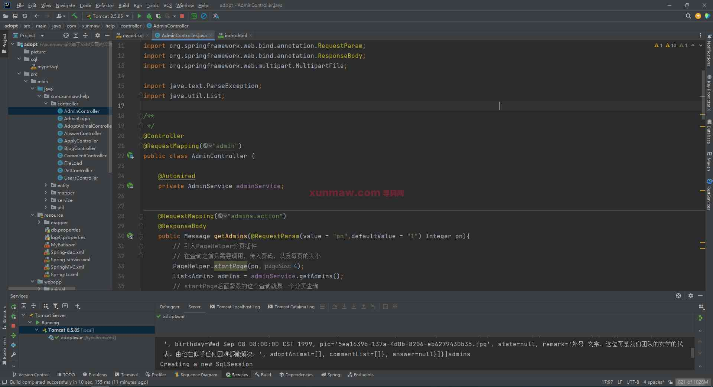  
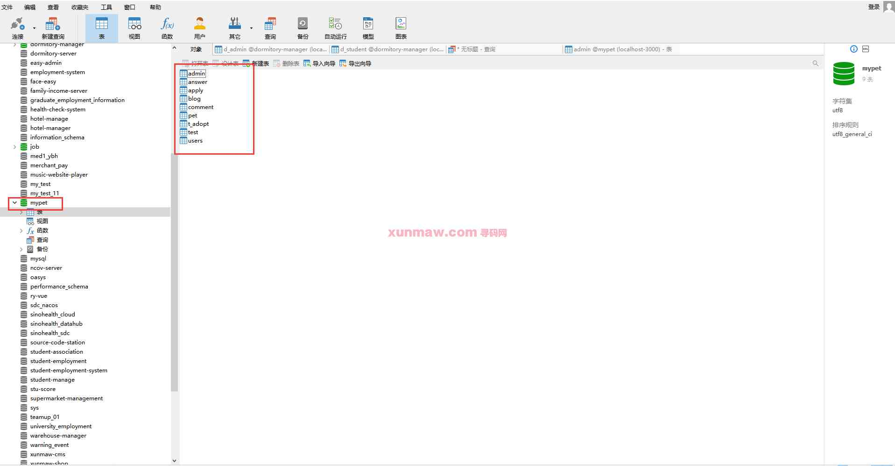  

##### 【功能详述】 
一、Web端  
  1. 主页  
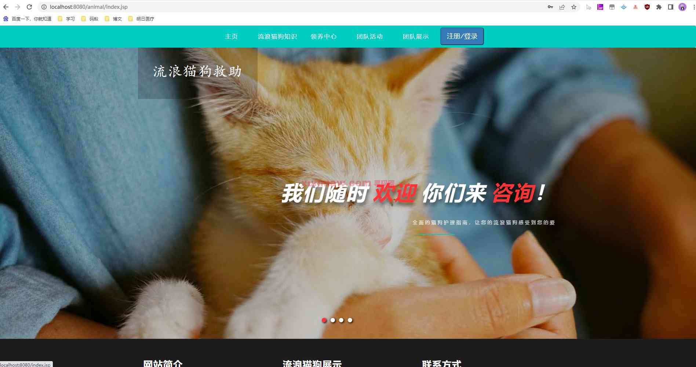

  2. 流浪猫狗知识  
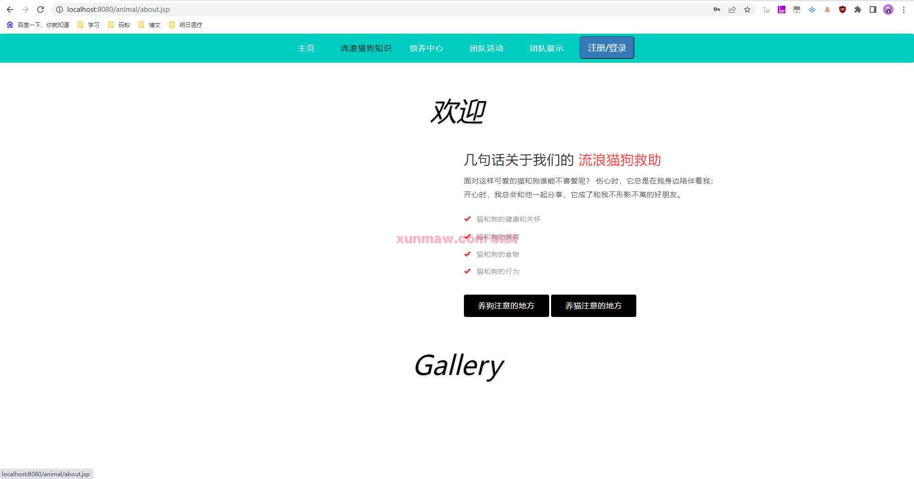

  3. 领养中心  
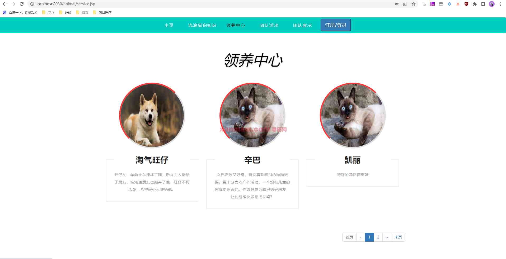

  4. 团队活动  
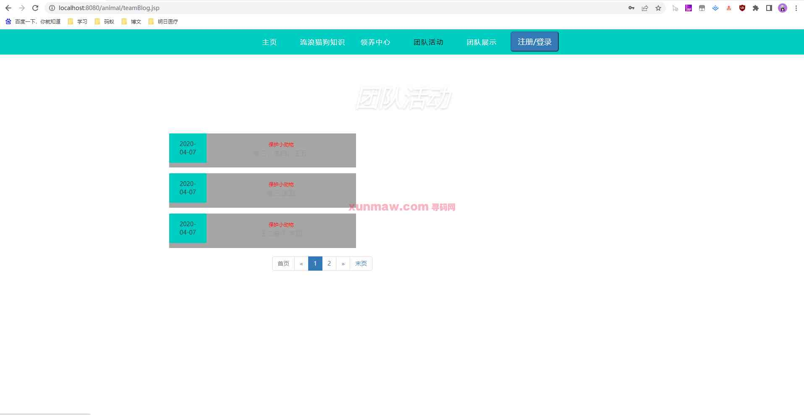

  5. 团队展示  
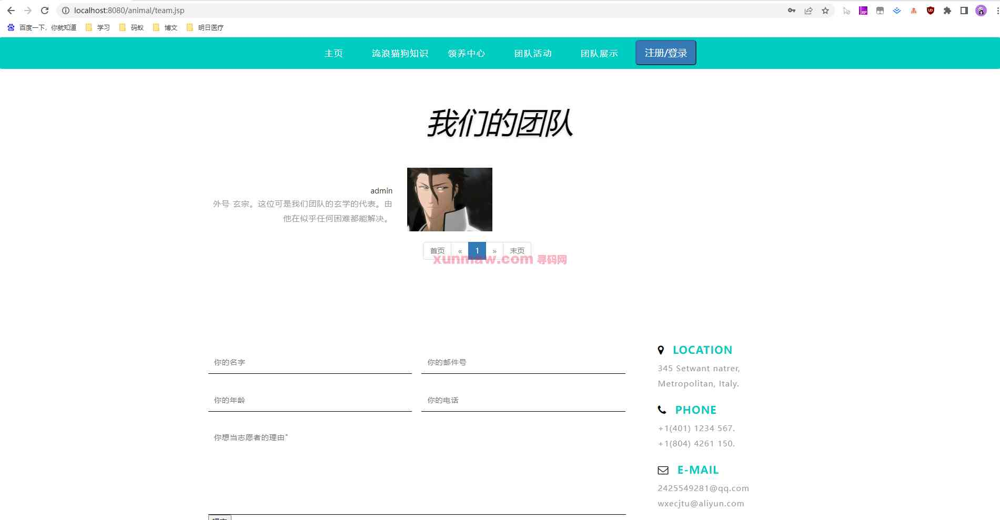

  6. 登录/注册中心  
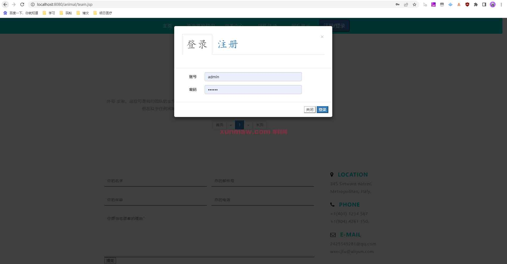

二、管理后台  
  1. 管理后台-用户信息  
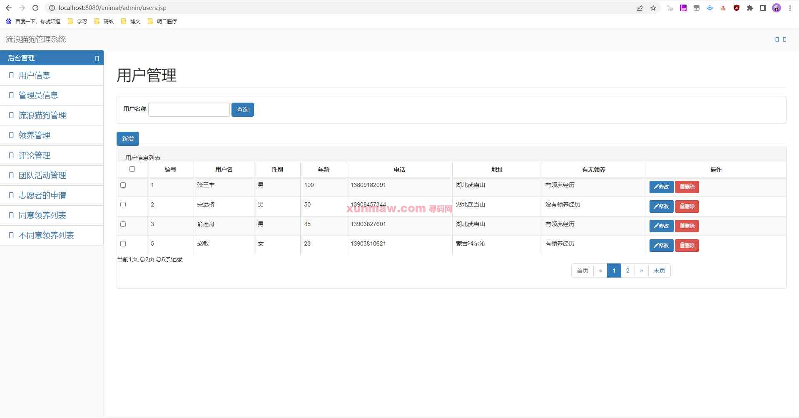

  2. 管理后台-管理员信息  
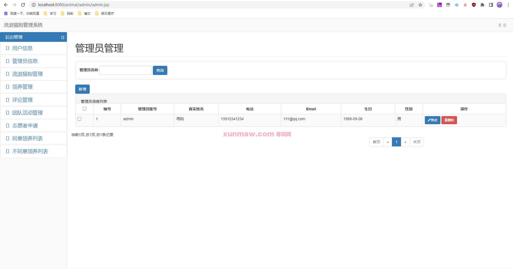

  3. 管理后台-流浪猫狗管理  
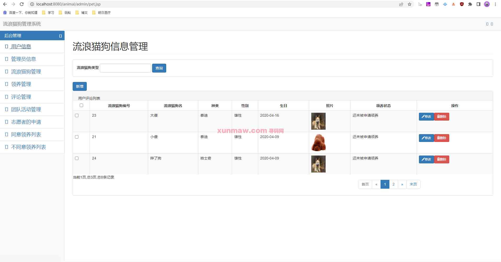

  4. 管理后台-领养管理  
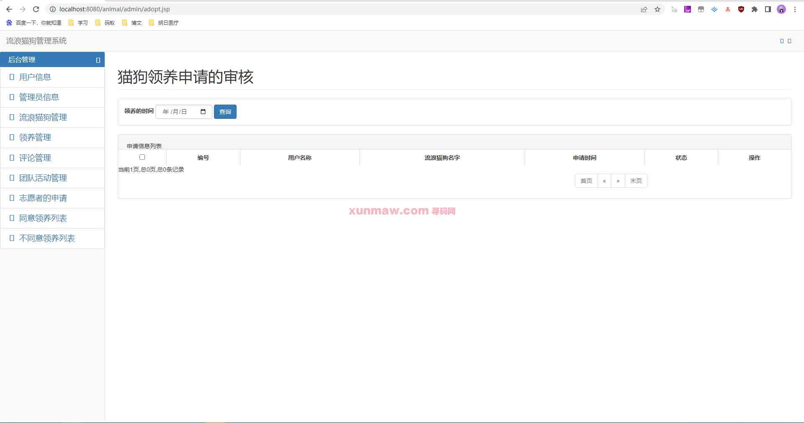

  5. 管理后台-评论管理  
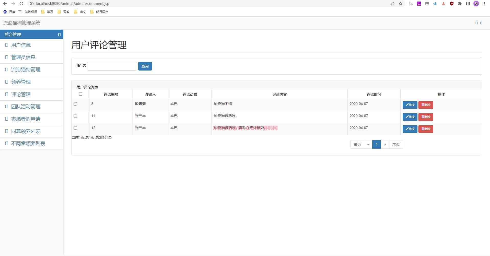

  6. 管理后台-团队活动管理  
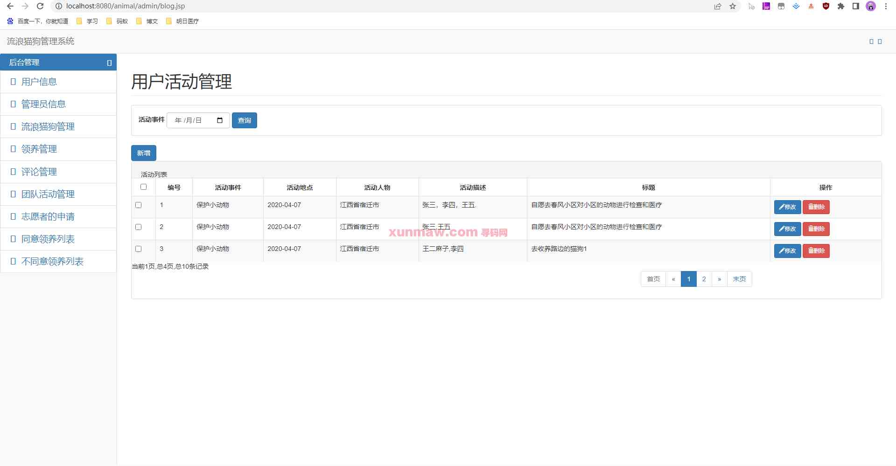

  7. 管理后台-自愿者申请  
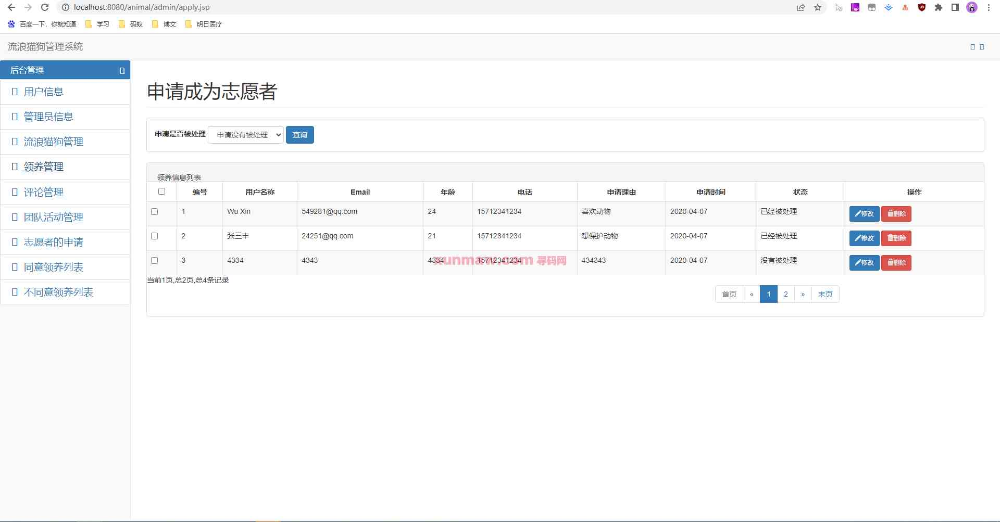

  8. 管理后台-同意领养列表  
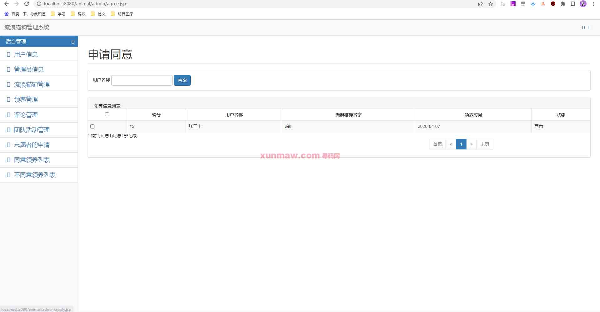

  9. 管理后台-不同意领养列表  
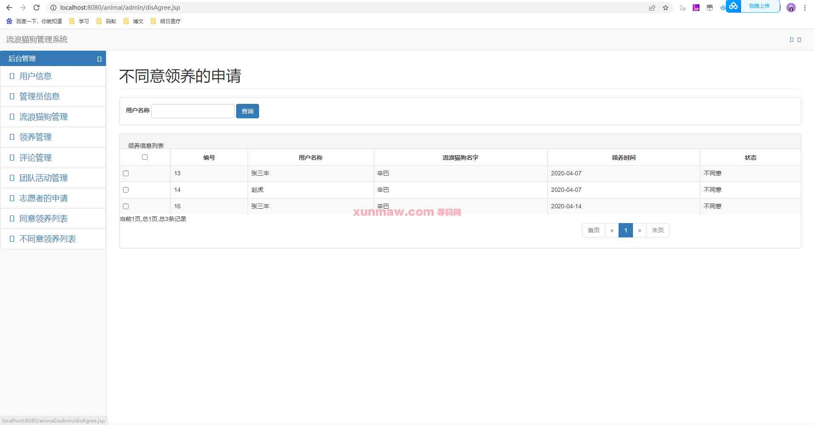

#### 使用说明
1. 创建数据库，执行数据库脚本  
2. 修改jdbc数据库连接参数  
3. 下载安装maven依赖jar  
4. 启动SpringBoot启动类  

后端管理： 
    请求地址： http://localhost:8080/animal  
    用户名：admin    
    密码：123456    

